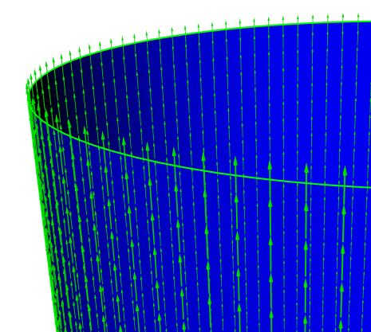
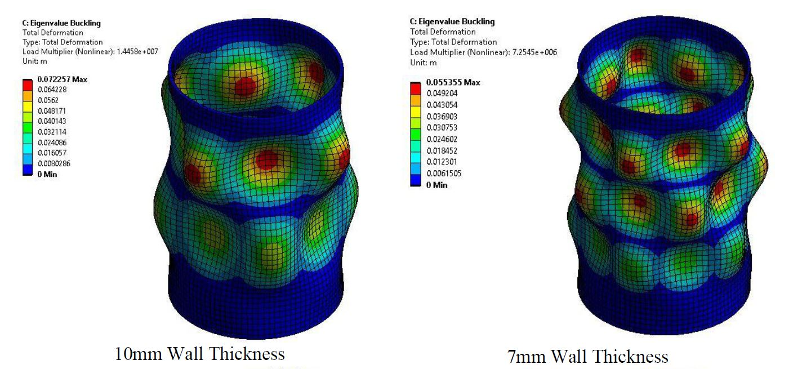
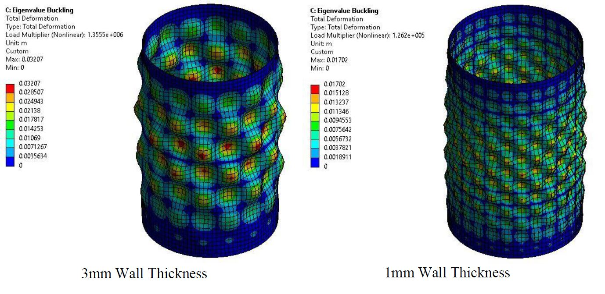

This project, which I worked on for a finite element analysis (FEA) course involved conducting simulations to investigate phenomena using finite element methods. I chose to study the effect of geometry on the compressive stresses experienced by unstiffened cylinders using ANSYS Workbench 2020 R2. Analysis packages such as static structural, eigenvalue buckling and ACP pre and post were used to determine the effect of altering the diameter to thickness ratio in the context of a racing car chassis.

The ACP Package in ANSYS was used to apply layers of shell elements to accurately model composite material.

The optimisation study showed predictably that as thickness is decreased, there is an increase in the buckling modes at which bifurcation takes place. That is, the thickness decreases, the critical buckling load decreases and the number of ripples seen at buckling increases. These ripples however, have smaller displacements.

