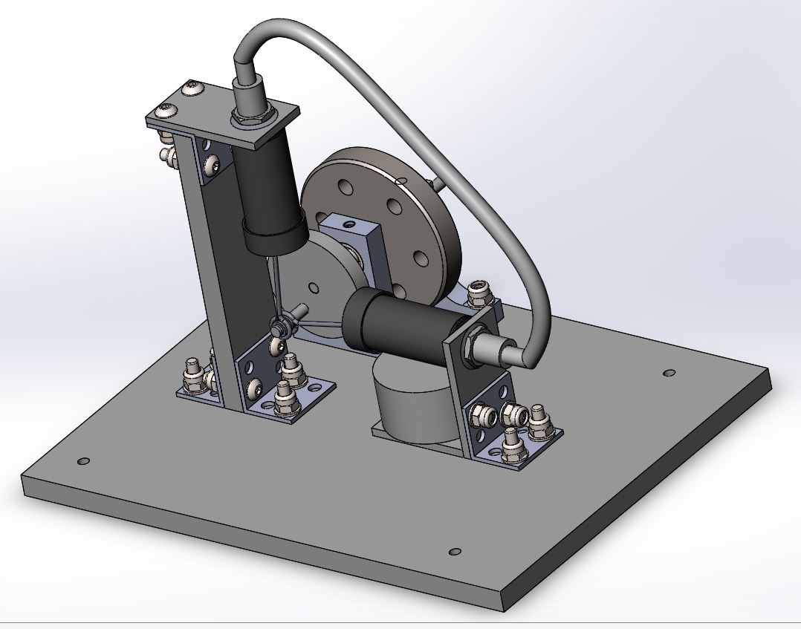

A group of students and I have been tasked with designing and assembling a stirling engine to be powered solely by a tealight candle.

Provided with the option of several off-the-shelf components, the rest of the components requiring machining from sheet metal or PVC to be laser cut.

Currently, the design has been finalised with drawings for manufacture having been apporoved and sent to the workshop, with assembly set to take place in a few weeks.

