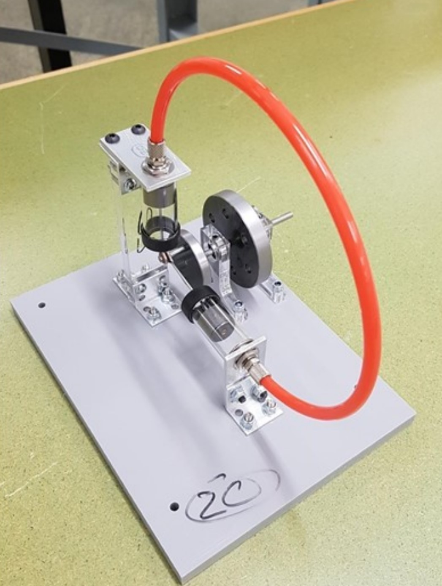

A group of students and I were tasked with designing and assembling a stirling engine to be powered solely by a tealight candle.

Provided with the option of several off-the-shelf components, the rest of the components requiring machining from sheet metal or PVC to be laser cut.

The design was been finalised with drawings for manufacture having been approved and sent to the workshop. Assembly was originally planned to be carried out in person by group members, however, due to the Sydney lockdown from mid-2021, assembly had to be carried out by UNSW technical staff and testing carried out personally by the course convenor.

Final product:

Our group's engine was the third-cheapest to manufacture and had the the fifth-lowest weight out of 32 engines.

For this project, I was presented the challenge of being a co-project manager for the group. The role involved delegating tasks, ensuring documentation met all requirements and followed standards as well as answering any queries from the group and chasing answers from our mentor or technical staff if need be.

The experience opened my eyes quite a bit to Project management and about myself really. I learned to be a little more assertive and have more confidence in myself. Unfortunately, we didn’t get to assemble the stirling engine ourselves due to the eventual lockdown but the engine performed quite well and we scored ourselves a distinction in the end.