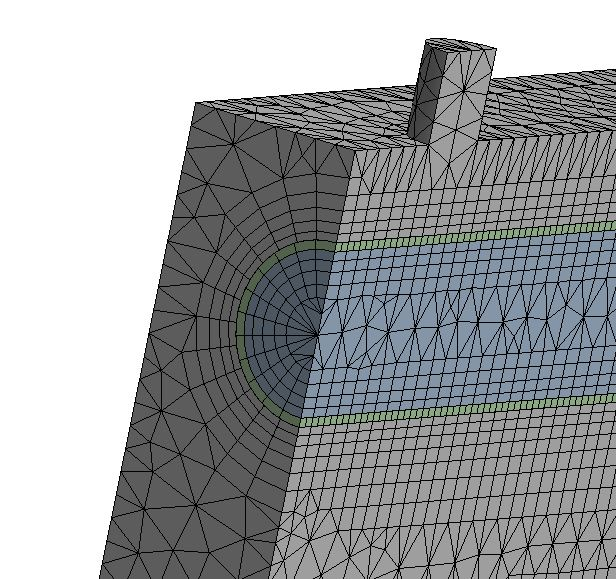
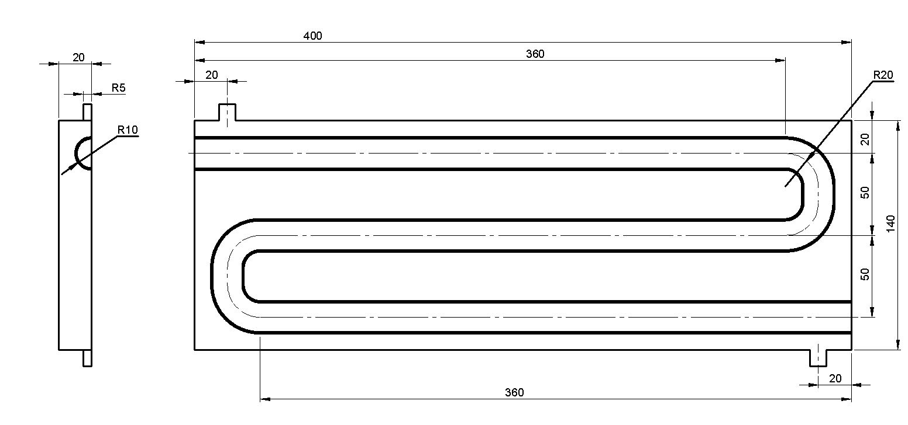
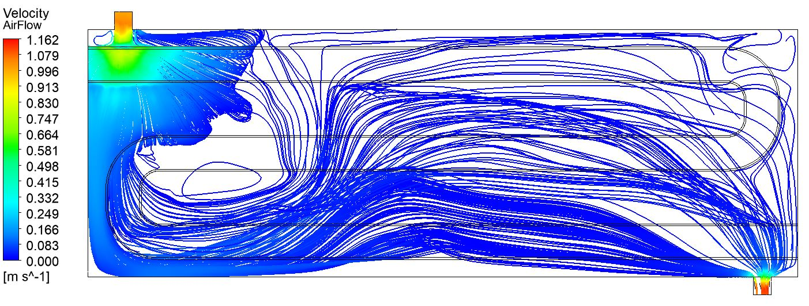
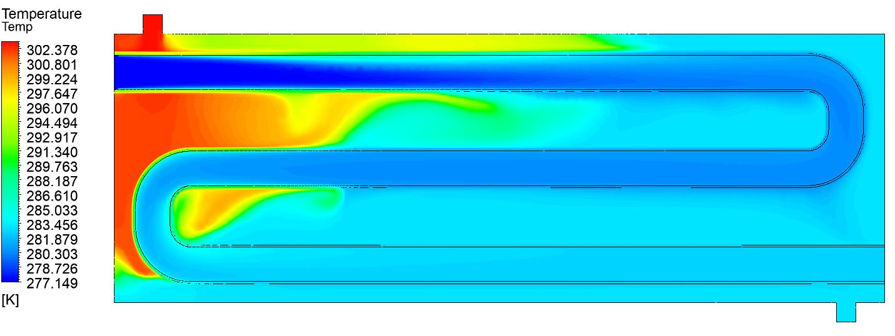
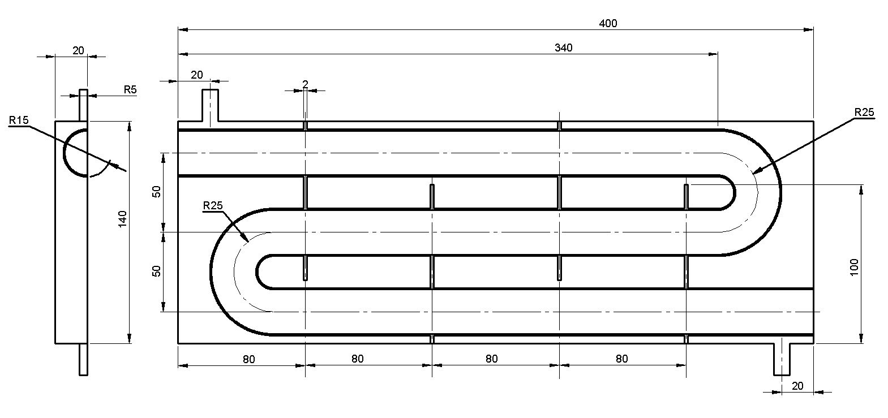
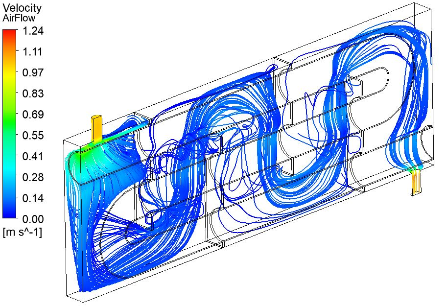
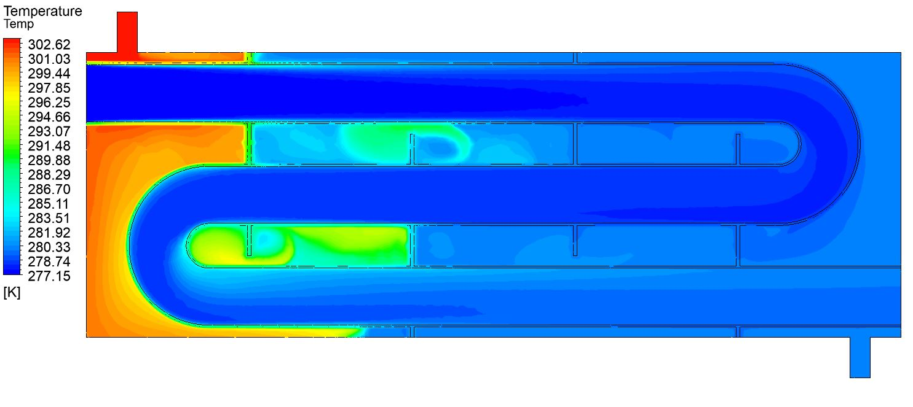

For a computational fluid dynamics course I took, I was tasked with simulating a given heat exchanger set-up and then optimising then design for better results. The task was a multi-faceted one which involved first constructing the heat exchanger using CAD. I did this using Solidworks and then imported the CAD into ANSYS. Using the CFX package on ANSYS, I was able to model the given heat exchanger design. 

Once completed, an optimised design was designed, once again using solidworks. This design implemented the use of baffles to optimise airflow.

This design was then put to the test and was found to be much more effective at dissipating heat from the hot air as can be seen from the below figures.

