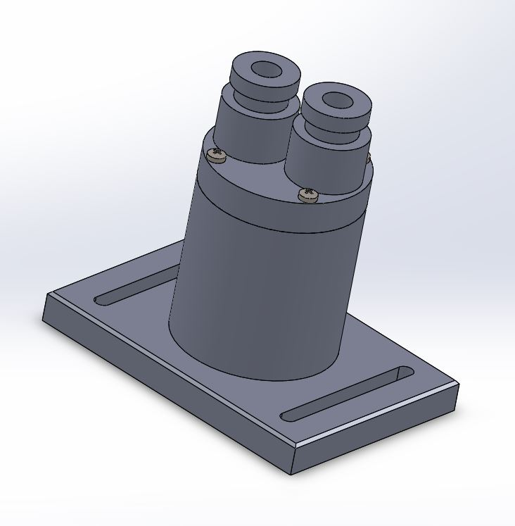
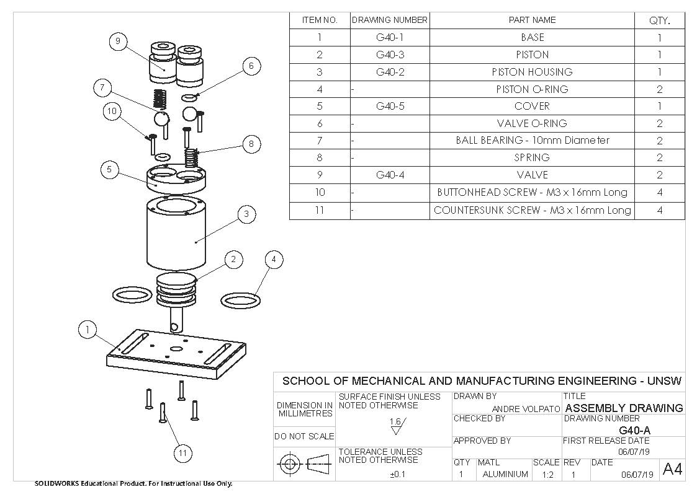

A group of other university student and I were tasked with designing, manufacturing and assembling a pneumatic vertical displacement pump to inflate and pop a balloon. The course included several weeks of attending classes at TAFE to learn a variety of manufacturing and fitting methods, culminating in making our very own pump by machining and fitting all parts ourselves. The end result was a successful pump which inflated and popped a balloon well within one minute.

Take a look at this [video](https://youtu.be/EVq0-BA2mTg) to see how well it worked!

