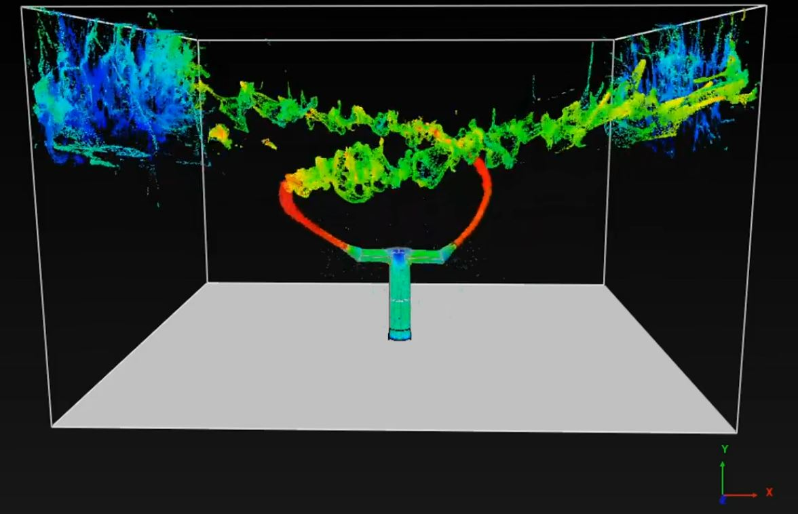
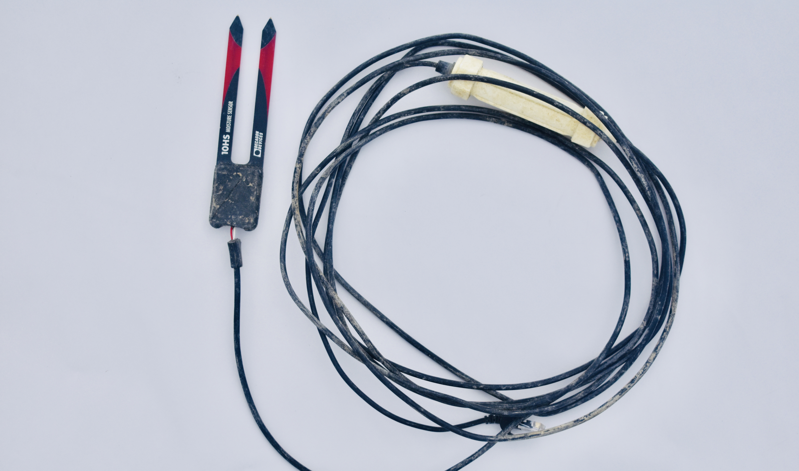

For my undergraduate Thesis, I have been tasked - as part of a group - to research, design, and demonstrate a viable proof-of-concept of a new manufacturing system as smart solution which utilises technology which embodies Industry 4.0. With each group member assuming the task of delivering a sub-system within a system.

Collectively, we have decided to implement solutions to alleviate problems faced within agriculture, with the system of sub-systems coming together to form a 'smart farm'.

My subsystem will be an autonomous irrigation system which utilises real-time data from startegically placed moisture sensors which optimise watering times and volumes.

Stay Tuned...