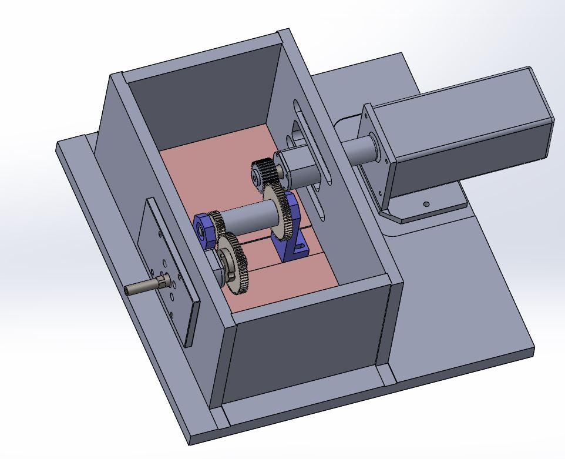

For this design project, a group of other students and I were tasked with designing and assembling part of a transmission system of a winch for a given hypothetical situation. Provided with input parameters and tasked with attaining desired output metrics, the system of gears and the shaft in which they were mounted on were designed using Solidworks. 

The gears were laser cut out of sheet metal at the facilities of NEPEAN Engineering & Innovation, an industry partner of UNSW and the shaft made in-house at the UNSW Mechanical Engineering workshop.

[Click here](https://youtu.be/gPDaY6g2T38) to view a short clip of the final system in action on testing day!